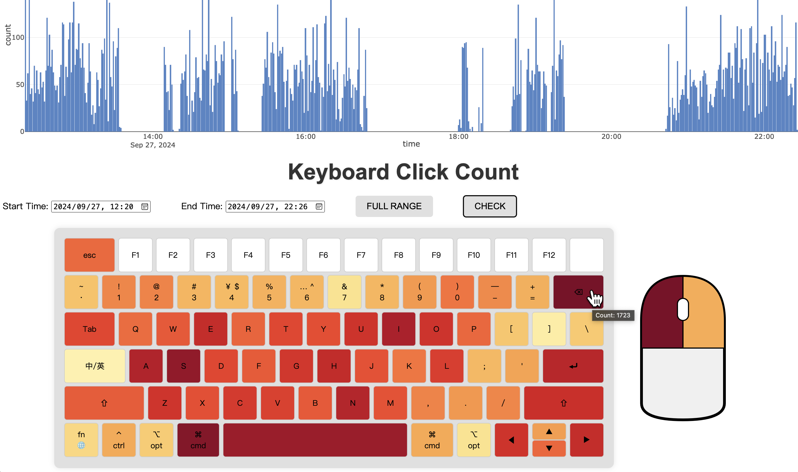
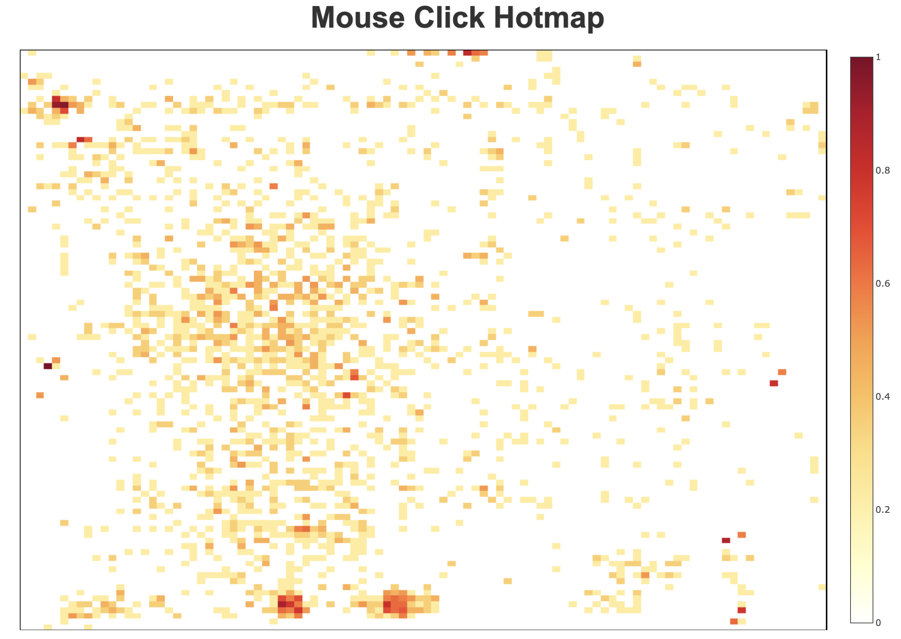

提醒：数据无价，更新前请备份数据文件夹（`data`）！

# KMCounter

KMCounter 是一个用于记录和显示键盘和鼠标点击次数的程序，并通过柱状图和热图展示。本软件基于 Python、Flask、Plotly 等开发。

已对 macOS 和 Windows 键盘都进行了适配。Linux 系统在 Ubuntu 24.04 下测试。

本程序网页使用 5000 端口，请确保该端口未被占用。

`*.bak` 为数据备份文件，每次运行程序时生成。

## 界面展示




## 功能

- 记录各键盘按键和鼠标点击次数
- 用柱状图展示点击次数随时间变化情况
- 根据时间范围过滤并用热力图可视化点击次数
- 热力图展示屏幕不同位置鼠标点击频率

## 安装及使用
1. 克隆此仓库：
    ```bash
    git clone https://github.com/SilentDeep/KMCounter.git
    # 或 git clone https://gitee.com/silent_deep/KMCounter.git
    cd KMCounter
    ```
### 从 Python 文件运行（需要使用者有一定 Python 基础）

2. 创建并激活虚拟环境（可选）：
    ```bash
    conda create -n KMCounter python=3.9 -y
    conda activate KMCounter
    ```

3. 安装依赖：
    ```bash
    pip install -r requirements.txt
    ```

4. 运行主程序：（先 `cd` 到 `KMCounter` 文件夹）
    ```bash
    python main.py
    ```

5. 打开浏览器并访问 [http://127.0.0.1:5000](http://127.0.0.1:5000) 查看用户界面。

### 运行可执行文件运行
2. 解压缩 release 文件夹中与电脑匹配的文件夹：苹果电脑选择 macOS，Windows 系统选择 Windows，Linux 系统选择 Linux；根据电脑构架选择 arm64 或 x86_64，一般苹果 M 系列芯片选择 arm64，其他芯片选择 x86_64。

3. 双击 `KMCounter` (Windows为 `KMCounter.exe`) 可执行文件运行程序，会弹出网页，如果显示无法连接可以稍后刷新网页重试。Windows 和 Linux 系统数据存储可执行文件所在文件夹的 `data` 子文件夹中，macOS 系统数据存储在用户目录的 `data` 子文件夹中。

    macOS 系统如果也希望数据存储在可执行文件所在文件夹：打开终端，`cd` 到解压缩后的文件夹内，运行程序 `./main`。


4. 可在浏览器中点击 `STOP` 或在终端（如有）按下 `Ctrl+C` 终止程序。

## 贡献

欢迎提交 issue 和 pull request 来改进此项目。

## 许可证

此项目使用 GNU General Public License v3.0 许可证。详情请参阅 [LICENSE](./LICENSE) 文件。

## Todo List
有空来填坑：
- [x] 屏幕鼠标点击位置热力图
- [x] 分多文件存储数据，避免数据量大读取速度慢
- [x] 增加 Windows 键盘
- [x] 编译可执行文件
- [ ] 某些特殊键未计入
- [ ] 丰富 summary

## 联系作者
Outlook: [silent_deep@outlook.com](mailto:silent_deep@outlook.com)